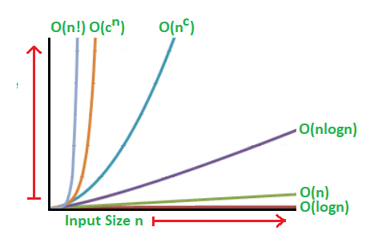

## Intro to Python

### An Introduction to Big O Notation

**_Big-O Notation_** is a simplified way to analyze how efficient the algorithm is. it's based on the computational steps in your algorithm and the complexity in terms of the input size. It accounts for both how efficient the algorithm is not only in terms of time but also in terms of the amount of memory it takes to process.
Big O is typically viewed in terms of worst-case scenario meaning it's accounting for the longest time it could take the code to run. It's used that way because it's used to analyze how inefficient your code could be. 
Here's a basic chart to visualize the efficiency in Big O:

### Facts and myths about Python names and values 

The behavior of names and values in Python can be confusing. Like many parts of Python Names refer to values. ex. (x = 23)
and Many names can refer to one value, [x = 23 , y = x] x and y both refer to the same value
Names are reassigned independently of other names. [x = 23, y = x, x = 12]
An important fact about assignment "Assignment never copies data." & "Changes in a value are visible through all of its names. (Mutable Presto-Chango)"
Some details about Python names and values:
- Any name can refer to any value at any time.
- Names have no type, values have no scope.
- Values can’t be deleted, only names can.
- Python has no variables.

## References
_______

[Python names and values ](https://nedbatchelder.com/text/names.html)