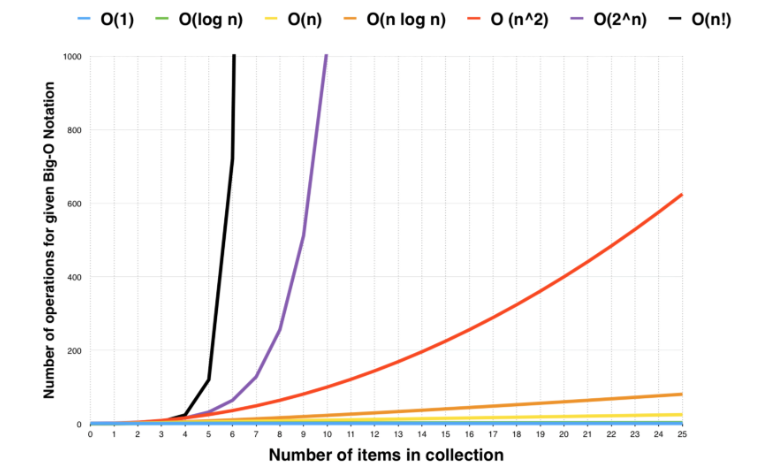

## Read 03 : Beginners Guide to Big O Notation

**Big O Notation is a way to represent how long an algorithm will take to execute. It enables a software Engineer to determine how efficient different approaches to solving a problem are.**

**Common Types of time complexities in Big O Notation:**

* **__O(1) - Constant time complexity__**

Constant time algorithms will always take same amount of time to be executed, independent of the size of the input.

* **__O(n) - Linear time complexity __**

An algorithm has a linear time complexity if the time to execute the algorithm is directly proportional to the input size n. Therefore the time it will take to run the algorithm will increase proportionately as the size of input n increases.

* **__O(log n) - Logarithmic time complexity __**

An algorithm has logarithmic time complexity if the time it takes to run the algorithm is proportional to the logarithm of the input size n.

* **__O(n^2) - Quadratic time complexity __**

An algorithm has quadratic time complexity if the time to execution it is proportional to the square of the input size. A good example of this is checking to see whether there are any duplicates in a deck of cards.

* the deeper nested loops will result in O(n^3), O(n^4).

## References
_______

[https://www.freecodecamp.org/](https://www.freecodecamp.org/news/my-first-foray-into-technology-c5b6e83fe8f1/)
