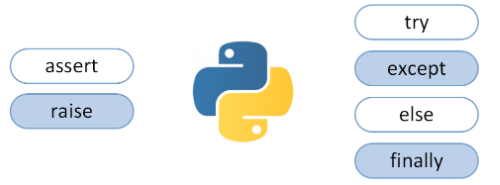
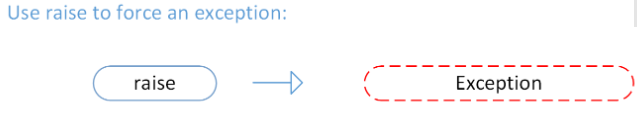
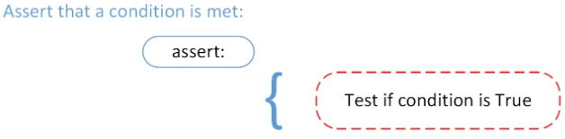
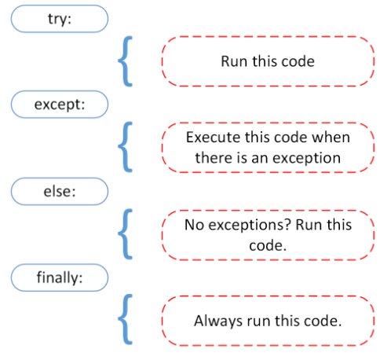

## FileIO & Exceptions

### Reading and Writing Files in Python (Guide)

[Read & Write Files in Python](https://realpython.com/read-write-files-python/)

a **__file__** is a contiguous set of bytes used to store data. This data is organized in a specific format and can be anything as simple as a text file or as complicated as a program executable. 

file systems are composed of three main parts:

1. Header
2. Data
3. End of file (EOF)

**File Paths** is required. The file path is a string that represents the location of a file. 
It’s broken up into three major parts: 
1. Folder Path  2. File Name  3. Extension

**common problem** that you may face when working with file data:

1. Line Endings : is the representation of a new line or line ending.
2. Character Encodings : An encoding is a translation from byte data to human readable characters. 

**Opening and Closing a File in Python**
When you want to work with a file, the first thing to do is to open it. After you open a file, the next thing to learn is how to close it.

there are two ways that you can use to ensure that a file is closed properly, even when encountering an error:

1. use the try-finally block:
>> reader = open('dog_breeds.txt')
try:
>>    #Further file processing goes here
>>finally:
    reader.close()

2. use the with statement:
>> with open('dog_breeds.txt') as reader:
>>    #Further file processing goes here

The with statement automatically takes care of closing the file once it leaves the with block, even in cases of error.

**mode.** This argument is a string that contains multiple characters to represent how you want to open the file.

1. 'r':	Open for reading (default)
2. 'w':	Open for writing, truncating (overwriting) the file first
3. 'rb' or 'wb'	: Open in binary mode (read/write using byte data)

**Reading and Writing Opened Files**

There are multiple methods that can be called on a file object to help you out:

1. .read(size=-1)	: This reads from the file based on the number of size bytes. If no argument is passed or None or -1 is passed, then the entire file is read.

2. .readline(size=-1)	: This reads at most size number of characters from the line. This continues to the end of the line and then wraps back around. If no argument is passed or None or -1 is passed, then the entire line (or rest of the line) is read.

3. .readlines()	: This reads the remaining lines from the file object and returns them as a list.

 file objects have multiple methods that are useful for **writing** to a file:

 1. .write(string)	: This writes the string to the file.

 2. .writelines(seq)	: This writes the sequence to the file. No line endings are appended to each sequence item. It’s up to you to add the appropriate line ending(s).

__________________

### Python Exceptions: An Introduction
[Exceptions in Python](https://realpython.com/python-exceptions/)

In Python, an error can be a syntax error or an exception.

* **exception error** , This type of error occurs whenever syntactically correct Python code results in an error.

* Instead of showing the message (exception error(), Python details what type of exception error was encountered. Ex: ZeroDivisionError.

* **Raising an Exception**: We can use raise to throw an exception if a condition occurs. The statement can be complemented with a custom exception.
>> x = 10
if x > 5:
>>    raise Exception('x should not exceed 5. The value of x was: {}'.format(x))

* **The AssertionError Exception** : We assert that a certain condition is met. If this condition turns out to be True, then that is excellent! The program can continue. If the condition turns out to be False, you can have the program throw an AssertionError exception.

* **The try and except Block: Handling Exceptions**
>> try:
    with open('file.log') as file:
        read_data = file.read()
except:
    print('Could not open file.log')

* **else** lets you code sections that should run only when no exceptions are encountered in the try clause.

* **finally** enables you to execute sections of code that should always run, with or without any previously encountered exceptions.

