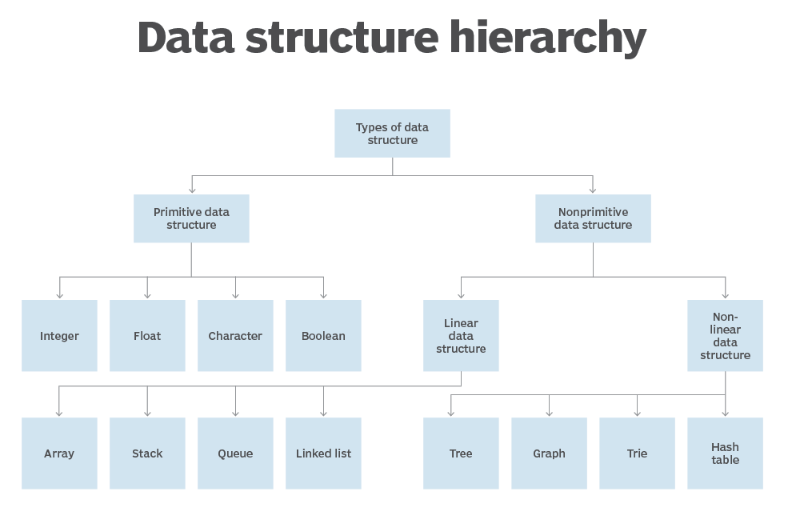
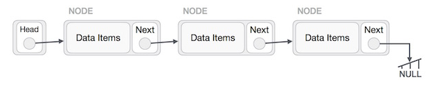

## data structure & LinkedList

### data structure

[What is the data structure](https://www.techtarget.com/searchdatamanagement/definition/data-structure#:~:text=A%20data%20structure%20is%20a,they%20need%20in%20appropriate%20ways.)

* A data structure is a specialized format for organizing, processing, retrieving and storing data.

* Data structures make it easy for users to access and work with the data they need in appropriate ways.

* In computer science/programming, a data structure designed to store data for the purpose of using it with various algorithms.

* in an object-oriented programming language, the data structure and its associated methods are bound together as part of a class definition.

**Why are data structures important?**

* Data structures bring together the data elements in a logical way and facilitate the effective use, persistence and sharing of data. They provide a formal model that describes the way the data elements are organized.

* Data structures are the building blocks for more sophisticated applications.

**How are data structures used?**

* data structures are used to implement the physical forms of abstract data types. Data structures are a crucial part of designing efficient software. They also play a critical role in algorithm design and how those algorithms are used within computer programs.

* many programming languages include an extensive collection of built-in data structures to organize code and information. For example, Python lists and dictionaries, and JavaScript arrays and objects are common coding structures used for storing and retrieving information.

* examples of how data structures are used: (Storing data, Managing resources and services, Data exchange, Ordering and sorting, Indexing, Searching, Scalability)

**Characteristics of data structures**

1. Linear or non-linear
2. Homogeneous or heterogeneous
3. Static or dynamic

**Data types**

(Boolean, integer, Floating-point numbers, Fixed-point numbers, Character, Pointers, String)

**Types of data structures**

(Array, Stack, Queue, Linked list, Tree, ...)

## LinkedList 

[What is LinkedList](https://www.tutorialspoint.com/data_structures_algorithms/linked_list_algorithms.htm)

* Linked lists are best if a program is managing a collection of items that don't need to be ordered, constant time is required for adding or removing an item from the collection and increased search time is OK.

* A linked list is a sequence of data structures, which are connected together via links

* Linked List Representation

   - Linked List contains a link element called first.

   - Each link carries a data field(s) and a link field called next.

   - Each link is linked with its next link using its next link.

   - Last link carries a link as null to mark the end of the list.

* Types of Linked List:

   - Simple Linked List 

   - Doubly Linked List 

   - Circular Linked List 

* Basic Operations:

   - Insertion 

   - Deletion 

   - Display 

   - Search 

   - Delete 
