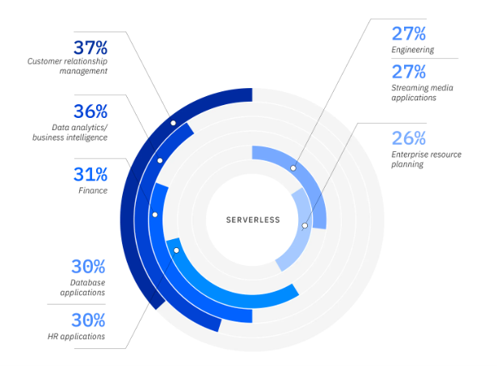

##  Serverless Functions

[What is Serverless Computing?](https://www.ibm.com/cloud/learn/serverless)

* Serverless is a cloud application development and execution model that lets developers build and run code without managing servers, and without paying for idle cloud infrastructure.

* Serverless lets developers put all their focus into writing the best front-end application code and business logic they can. and deploy it to containers managed by a cloud service provider. 

* Serverless does not mean 'no servers':
The name notwithstanding, there are most definitely servers in serverless computing. 'Serverless' describes the developer’s experience with those servers—they are are invisible to the developer, who doesn't see them, manage them, or interact with them in any way.

* cloud service provider offers a serverless platform including Amazon Web Services (AWS Lambda), Microsoft Azure (Azure Functions), Google Cloud (Google Cloud Functions) and IBM Cloud (IBM Cloud Code Engine). Together serverless computing, 

* Function-as-a-service, or FaaS, is a cloud computing service that enables developers to run code or containers in response to specific events or requests, without specifying or managing the infrastructure required to run to code.

* serverless is much more than FaaS. Serverless is an entire stack of services that can respond to specific events or requests, and scale to zero when no longer in use—and for which provisioning, management and billing are handled by the cloud provider and invisible to developers.

*  In addition to FaaS, these services include:

    - Serverless databases and storage.

    - Event streaming and messaging.

    - API gateways.

* Pros:

  serverless computing offers a number of technical and business benefits to individual developers and enterprise development teams:

    - Improved developer productivity

    - Pay for execution only

    - Develop in any language

    - Streamlined development/DevOps cycles.

    - Cost-effective performance.

    - Usage visibility.

* Cons
  there are drawbacks—some of which are related to specific applications, and others which are universal:

    - Unacceptable latency for certain applications.

    - Higher costs for stable or predictable workloads.

    - Monitoring and debugging issues.

    - Vendor lock-in.

* **How serverless is being used:** Survey respondents identified over a dozen serverless applications in use. The most commonly cited applications included CRM, data analytics/business intelligence, finance, database, HR, engineering, streaming media and ERP.

