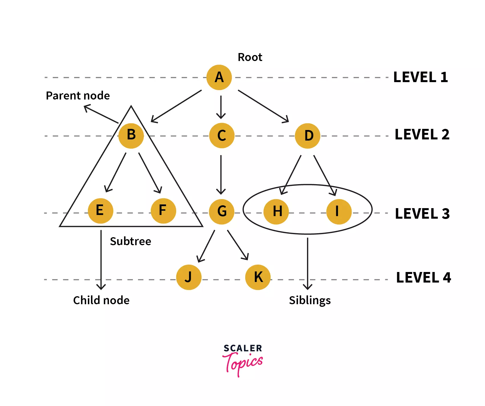

## Read 15 - Tree

### Introduction to Tree

[Tree Data Structure](https://www.programiz.com/dsa/trees)

* **A tree** is a nonlinear hierarchical data structure that consists of nodes connected by edges.

* **Why Tree Data Structure?**
Other data structures such as arrays, linked list, stack, and queue are linear data structures that store data sequentially. In order to perform any operation in a linear data structure, the time complexity increases with the increase in the data size. But, it is not acceptable in today's computational world.

Different tree data structures allow quicker and easier access to the data as it is a non-linear data structure.

* **Tree Terminologies**:
    - Node: is an entity that contains a key or value and pointers to its child nodes.

    - Edge :It is the link between any two nodes.

    - Root : It is the topmost node of a tree.

    - (Height / Depth) of a Node: the number of edges from the node to the deepest leaf, the longest path / the number of edges from the root to the node.

    - Height of a Tree: height of the root node or the depth of the deepest node.

    - Degree of a Node:  total number of branches of that node.
    
    - Forest: A collection of disjoint trees is called a forest.

### Binary Trees in Python

[Binary Trees in Python](https://www.educative.io/answers/binary-trees-in-python)