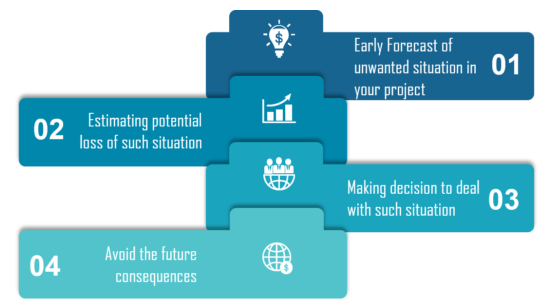

## Read 06 - OOP Part02

### Design Patterns
[What are Design Patterns](https://medium.com/@Mahmoud_Zalt/software-design-patterns-simplified-8a72232d52b1)

* A design pattern is only a description or template for how to solve a problem! that can be used in many different situations.

* Patterns are formalized best practices that the Software Developer can use to solve common problems when designing an application.

* Patterns that imply object-orientation or more generally mutable state, are not as applicable in functional programming languages.

* difference between: 
    - Programming Paradigms: A way to classify programming languages based on their coding styles and features (Procedural, Functional, Object-oriented.)
    - Architectural Patterns: Reusable solution to a commonly occurring problem in software architecture within a given context. 
    - Design Patterns: Reusable solution to a commonly occurring problem in software design within a given context, in many different situations (Bridge, Builder, Strategy…).
    - Design Principles: Represent a set of guidelines that help developers to avoid having a bad design.

* 3 major types of design patterns: 
    - Creational Patterns: provide ways to instantiate single or groups of objects. (Factory Method, Singleton, Abstract Factory)
    - Structural Patterns: Structural patterns provide a manner to define relationships between classes or objects. Making it easier for these entities to work together. (Facade, Adapter, Decorator)
    - Behavioral Patterns: Behavioral patterns define manners of communication between classes and objects. Making it easier and more flexible for these entities to communicate. (Observer, Mediator, Chain of Responsibility)

### Risk Analysis
[What is Risk Analysis in Software Testing and how to perform it?](https://www.edureka.co/blog/risk-analysis-in-software-testing/)

*  **risk analysis** is the process of identifying the risks in applications or software that you built and prioritizing them to test. After that, the process of assigning the level of risk is done. The categorization of the risks takes place, hence, the impact of the risk is calculated.

* **Why use Risk Analysis?**
    - highlights the potential problem areas.
    - helps the developers and managers to mitigate the risks. 
    - create test plan.
    - solutions.

* different sets of risks included in the risk identification process:
    - Business Risks
    - Testing Risks
    - Premature Release Risk
    - Software Risks

* 

* How to perform Risk Analysis?
    - Searching the risk
    - Analyzing the impact of each individual risk
    - Measures for the risk identified

### Dependency Injection
[intro to Dependency Injection](https://www.freecodecamp.org/news/a-quick-intro-to-dependency-injection-what-it-is-and-when-to-use-it-7578c84fa88f/)

* **dependency injection** is a technique whereby one object (or static method) supplies the dependencies of another object. A dependency is an object that can be used (a service).

* to understand: When class A uses some functionality of class B, then its said that class A has a dependency of class B.

* There are basically three types of dependency injection:
    - constructor injection.
    - setter injection.
    - interface injection. 

* So the dependency injection’s responsibility to:
    - Create the objects
    - Know which classes require those objects
    - And provide them all those objects

* Benefits of using DI : 
    - Helps in Unit testing.
    - Boiler plate code is reduced, as initializing of dependencies is done by the injector component.
    - Extending the application becomes easier.
    - Helps to enable loose coupling, which is important in application programming

* Libraries and Frameworks that implement DI: 
    - (Spring (Java), Google Guice (Java), Dagger (Java and Android), Castle Windsor (.NET), Unity(.NET))